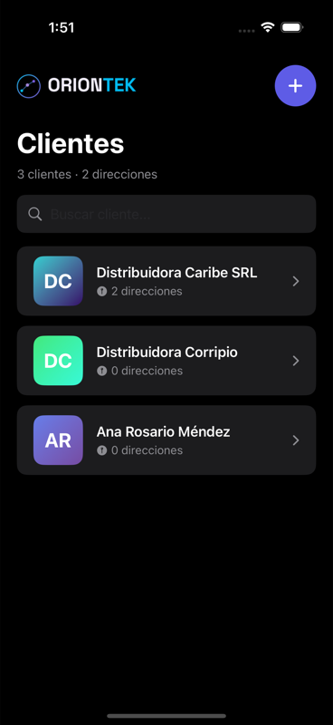
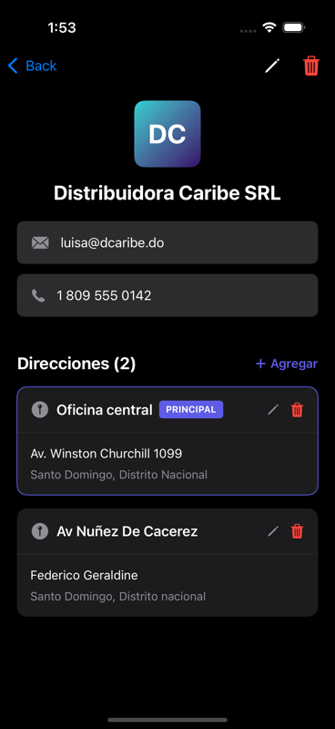
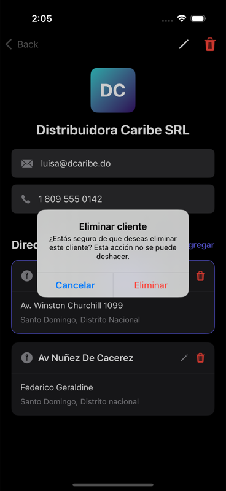

# OrionTek Address Manager

Aplicación iOS para la gestión de clientes y sus direcciones, desarrollada como prueba técnica para OrionTek.

##  Preview

<p align="center">
  
  
  
  
  
  
</p>


##  Características

-  **Gestión completa de clientes** - Crear, leer, actualizar y eliminar clientes
-  **Múltiples direcciones por cliente** - Cada cliente puede tener N direcciones
-  **Búsqueda en tiempo real** - Filtrado instantáneo por nombre de cliente
-  **Dirección principal** - Marcado de dirección principal (solo una por cliente)
-  **Persistencia local** - Los datos se guardan automáticamente con UserDefaults
-  **Avatares dinámicos** - Iniciales con gradientes únicos por cliente

##  Tecnologías

- **Swift 5.9+**
- **SwiftUI** - Framework declarativo de UI
- **MVVM** - Arquitectura Model-View-ViewModel
- **Codable** - Serialización JSON
- **UserDefaults** - Persistencia local
- **Xcode 16.4**
- **iOS 17.0+**

##  Instalación

1. Clonar el repositorio:
```bash
git clone https://github.com/JeromyMD/OrionTek-Address-Manager-.git
```

2. Abrir el proyecto:
```bash
cd OrionTek-Address-Manager-
open OrionTek_Address_Gestor.xcodeproj
```

3. Ejecutar en el simulador o dispositivo físico:
   - Seleccionar un simulador 
   - Presionar `⌘ + R` o click en el botón Play

**Nota:** No requiere dependencias externas ni CocoaPods/SPM.

##  Arquitectura

El proyecto sigue el patrón **MVVM (Model-View-ViewModel)** con separación clara de responsabilidades:
